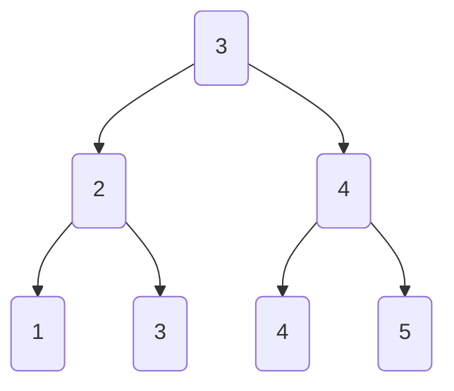
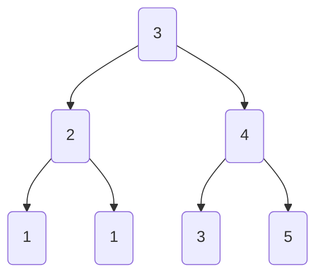
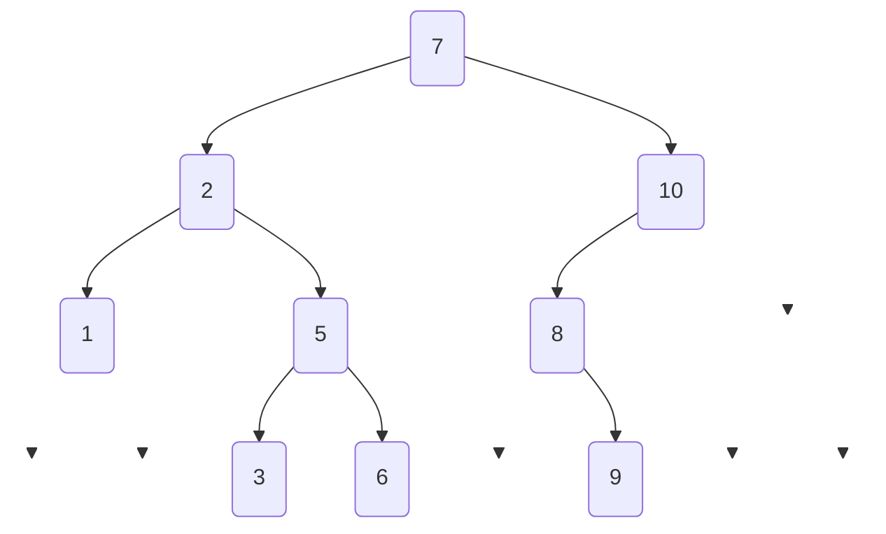
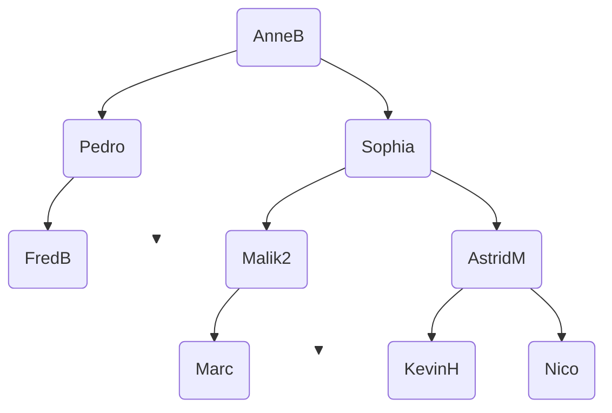
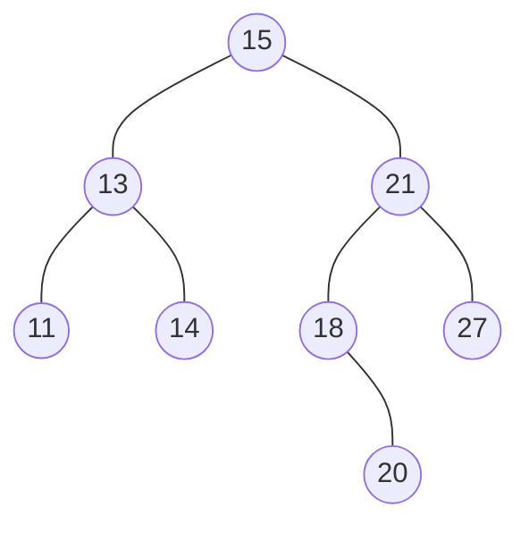
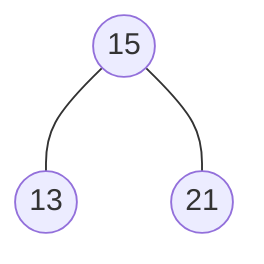

# Evaluation : Arbres binaires et arbres binaires de recherche
## Question de cours

On note h la hauteur d'un arbre binaire et n sa taille.  
En utilisant vos connaissances de cours, prouver que $h \leqslant n \leqslant 2^h -1$.


## D'aprés exercice BAC

_Cet exercice porte sur le thème "Algorithmique", les arbes bianires de recherche et leurs parcours._  

**Rappel :** Un arbre binaire de recherche (ABR) est un arbre binaire étiqueté avec des clés tel que :  

- Les clés du sous-arbre gauche sont inférieures ou égales à celle de la racine;
- Les clés du sous-arbre droit sont strictement supérieures à celle de la racine;
- Les deux sous-arbres sont eux-mêmes des arbres binaires de recherche.


### Partie A : Préambule

#### Question A.1
Recopier sur votre copie le ou les numéro(s) correspondant aux arbres binaires de recherche parmi les arbres suivants : 

1.


2.


3.


### Partie B : Analyse  

On considère la structure de données abstraites ABR (Arbre Binaire de Recherche) que l'on munit des opérations suivantes : 

#### Strucutres de données ABR
Utilise : Booleen, Element   
Opérations :  
    - `creer_arbre()` : renvoie un arbre vide  
    - `est_vide(a)` : renvoie `True` si l'arbre a est vide et `False` sinon  
    - `racine(a)` : renvoie la clé de la racine de l'arbre non vide a.  
    - `sous_arbre_gauche(a)` : renvoie le sous-arbre gauche de l'arbre non vide a.  
    - `sous_arbre_droit(a)` : renvoie le sous-arbre droit de l'arbre non vie a.  
    - `ìnserer(a,e)` insère la clé e dans l'arbre a.  


#### Question B.2.a
Dans un ABR, où se trouve le plus petit élément ? Justifier  

Pour rechercher une clé dans un ABR, il faut comparer la clé donnée avec la clé située à la racine. Si cette clé est ç la racine, la fonction renvoie vrai sinon il faut procéder récursivement sur les sous-arbres à gauche ou à droite.   

#### Question B.2.b
En utilisant les fonctions ci-dessus, écrire une fonction récursive `RechercheValeur` prenant en arguments la clé recherchée et l'arbre ABR considèré. Cette fonction retourne un booléen (vrai ou faux) indiquant si la clé est présente dans l'arbre ou non.  

#### Question B.3
On considère l'arbre ABR suivant : 


* a. Donner le parcours infixe de cette arbre.  
* b. Donner le parcours suffixe de cette arbre.  
* c. Donner le parcours préfixe de cette arbre.  
* d. Donner le parcours en largeur d'abord de cette arbre.

## D'aprés exercice BAC

#### Club d'Informatique

> D'après 2022, Nouvelle-Calédonie, J1, Ex. 4

Un club de passionné⋅e⋅s d'informatique fonctionne de la façon suivante : pour être membre du club, à l'exception du fondateur ou de la fondatrice, il faut être parrainé⋅e. De plus, chaque membre peut parrainer au maximum deux personnes.

Dans ce club, on distingue trois profils de membres :

- membre or : le membre a parrainé deux personnes ;
- membre argent : le membre a parrainé une seule personne ;
- membre bronze : le membre n'a parrainé personne.

On peut modéliser ce fonctionnement de parrainage à l'aide d'un arbre binaire dont les étiquettes sont les pseudonymes des membres du club. Lorsque deux personnes ont été parrainées, celle qui a été parrainée en premier apparait comme racine du sous-arbre à gauche tandis que l'autre est racine du sous-arbre à droite.

On donne ci-dessous l'arbre $P$ représentant les membres du club issus des parrainages de AnneB, fondatrice du club. Par exemple, Sophia a parrainé Malik2 avant AstridM.



On munit la structure de données `ArbreBinaire` des opérations suivantes :

```python
def est_vide(arbre: ArbreBinaire) -> bool:
    """renvoie True si arbre est vide, False sinon"""

def racine(arbre: ArbreBinaire) -> str:
    """renvoie l'étiquette du nœud racine de arbre"""

def gauche(arbre: ArbreBinaire) -> ArbreBinaire:
    """renvoie le sous-arbre à gauche de arbre"""

def droite(arbre: ArbreBinaire) -> ArbreBinaire:
    """renvoie le sous-arbre à droite de arbre"""
```

#### Question 1
On appelle feuille, un nœud qui ne possède pas de successeurs ou dit autrement dont l'arbre dont il est la racine possède deux sous-arbres vides. On définit la hauteur d'un arbre binaire non vide comme la longueur (en nombre de nœuds) du plus long chemin allant de la racine à une feuille. Un arbre vide a une hauteur égale à $0$. 

* a) **Indiquer** la hauteur de l'arbre $P$  
* b) **Recopier** et **compléter** la définition de la fonction récursive `hauteur` qui prend un `arbre` binaire en paramètre et renvoie la hauteur de cet `arbre`. On pourra utiliser la fonction `max` renvoyant la valeur maximale entre deux valeurs.

```python title="hauteur" linenums="1"
def hauteur(arbre):
    if ...... :
        return 0
    else:
        hauteur_a_gauche = hauteur(gauche(arbre))
        hauteur_a_droite = ......
        return 1 + ......
```  
* c) **Indiquer** le type de la valeur renvoyée par la fonction `hauteur`


#### Question 2
La fonction `membres` ci-dessous prend un `arbre` binaire et une `liste_membres` en paramètres et ajoute, dans un certain ordre, les étiquettes de l'`arbre` à la `liste_membres`.

```python title="membres" linenums="1"
def membres(arbre, liste_membres):
    if not est_vide(arbre):
        liste_membres.append(racine(arbre))
        membres(gauche(arbre), liste_membres)
        membres(droite(arbre), liste_membres)
```

* a) En supposant la liste `membres_p` initialement vide, **écrire** la valeur de cette liste après l'appel `membres(arbre_p, membres_p)` où `arbre_p` référence l'arbre $P$.

* b) **Indiquer** le nom du type de parcours d'arbre binaire réalisé par la fonction `membres`.


#### Question 3
Dans cette question, on s'intéresse aux profils des membres (or, argent ou bronze).

* a) **Indiquer** les étiquettes des feuilles de l'arbre $P$.  
* b) À partir des propositions suivantes, **indiquer** le profil des membres dont les pseudonymes sont les étiquettes des feuilles.

    - Réponse A : membre or
    - Réponse B : membre argent
    - Réponse C : membre bronze
    - Réponse D : on ne peut pas savoir

* c) **Écrire** la fonction `profil` qui prend un `arbre` binaire non vide en paramètre et renvoie le profil du membre dont le pseudonyme est l'étiquette de la racine de l'`arbre` sous la forme d'une chaine de caractères : `'or'`, `'argent'` ou `'bronze'`. Par exemple, l'appel `profil(arbre_p)` doit renvoyer `'or'`qui correspond au profil du membre `'AnneB'`, racine de $P$.

#### Question 4
Afin d'obtenir un tableau dont chaque élément est un _tuple_ contenant le pseudonyme d'un membre et son profil, on propose la fonction `membres_profils` définie ci-dessous :

```python title="membres_profils" linenums="1"
def membres_profils(arbre, liste_membres_profils):
    if not est_vide(arbre):
        liste_membres_profils.append((racine(arbre), profil(arbre))
        membres_profils(gauche(arbre), liste_membres_profils)
        membres_profils(droite(arbre), liste_membres_profils)
```

On appelle cette fonction sur un arbre `arbre_2` et on obtient ceci :

```pycon
>>> liste_2 = []
>>> membres_profils(arbre_2, liste_2)
>>> liste_2
[('LeaC', 'or'), ('Ali', 'bronze'), ('Tom45', 'argent'), ('Vero', 'bronze')]
```

**Dessiner** un arbre possible pouvant correspondre à l'`arbre_2`.

#### Question 5
Chaque année, les membres versent une cotisation en fonction de leur profil.

- membre or : cotisation de 20€
- membre argent : cotisation de 30€
- membre bronze : cotisation de 40€

**Écrire** une fonction `cotisation` qui prend un `arbre` binaire et renvoie le total des cotisations reçues par le club dont `arbre` modélise les relations de parrainage. On pourra utiliser la fonction `membres_profils` de la question précédente.


## D'aprés exercice BAC

#### Insertion et valeurs supérieures dans un ABR

> D'après 2022, Métropole, J2, Ex. 1

Dans cet exercice, la taille d'un arbre est le nombre de nœuds qu'il contient. Sa hauteur est le nombre de nœuds du plus long chemin qui joint le nœud racine à l'une des feuilles (nœuds sans sous-arbres). On convient que la hauteur d'un arbre ne contenant qu'un nœud vaut 1 et la hauteur de l'arbre vide vaut 0.


On considère l'arbre binaire représenté ci-dessous :



#### Question 1
* 1.a. Donner la taille de cet arbre.  
* 1.b. Donner la hauteur de cet arbre.  
* 1.c. Représenter sur la copie le sous-arbre à droite du nœud de valeur 15.  
* 1.d. Justifier que l'arbre de la figure 1 est un arbre binaire de recherche.  
* 1.e. On insère la valeur 17 dans l'arbre de la figure 1 de telle sorte que 17 soit une nouvelle feuille de l'arbre et que le nouvel arbre obtenu soit encore un arbre binaire de recherche. Représenter sur la copie ce nouvel arbre.*


On considère l'arbre la classe `Noeud` définie de la façon suivante en Python :

```python linenums="1"
class Noeud:
    def __init__(self, gauche, valeur, droite):
        self.gauche = gauche
        self.valeur = valeur
        self.droite = droite
```

#### Question 2
**2.a.** Parmi les trois instructions **(A)**, **(B)** et **(C)** suivantes, écrire sur la copie la lettre correspondant à celle qui construit et stocke dans la variable `abr` l'arbre représenté ci-dessous.



* **(A)** `abr = Noeud(Noeud(Noeud(None, 13, None), 15, None), 21, None)`  
* **(B)** `abr = Noeud(None, 13, Noeud(Noeud(None, 15, None), 21, None))`  
* **(C)** `abr = Noeud(Noeud(None, 13, None), 15, Noeud(None, 21, None))`  

**2.b.** Recopier et compléter la ligne 7 du code de la fonction `inserer` ci-dessous qui prend en paramètres une valeur `v` et un arbre binaire de recherche `abr` et qui renvoie l'arbre obtenu suite à l'insertion de la valeur v dans l'arbre `abr`. Les lignes 8 et 9 permettent de ne pas insérer la valeur `v` si celle-ci est déjà présente dans `abr`.

```python linenums="1"
def inserer(v, abr):
    if abr is None:
        return Noeud(None, v, None)
    if v > abr.valeur:
        return Noeud(abr.gauche, abr.valeur, inserer(v, abr.droite))
    elif v < abr.valeur:
        return ...
    else:
        return abr
```


**3.** La fonction `nb_sup` prend en paramètres une valeur `v` et un arbre binaire de recherche `abr` et renvoie le nombre de valeurs supérieures ou égales à la valeur `v` dans l'arbre `abr`. 

Le code de cette fonction `nb_sup` est donné ci-dessous :
       
```python linenums="1"
def nb_sup(v, abr):
    if abr is None:
        return 0
    elif abr.valeur >= v:
        return 1+nb_sup(v, abr.gauche)+nb_sup(v, abr.droite)
    else:
        return nb_sup(v, abr.gauche)+nb_sup(v, abr.droite)
```

#### Question 3
**3.a.** On exécute l'instruction `nb_sup(16, abr)` dans laquelle `abr` est l'arbre initial de la question **1.**. Déterminer le nombre d'appels à la fonction `nb_sup`.  
**3.b.** L'arbre passé en paramètre étant un arbre binaire de recherche, on peut améliorer la fonction `nb_sup` précédente afin de réduire ce nombre d'appels.  
Écrire sur la copie le code modifié de cette fonction.
